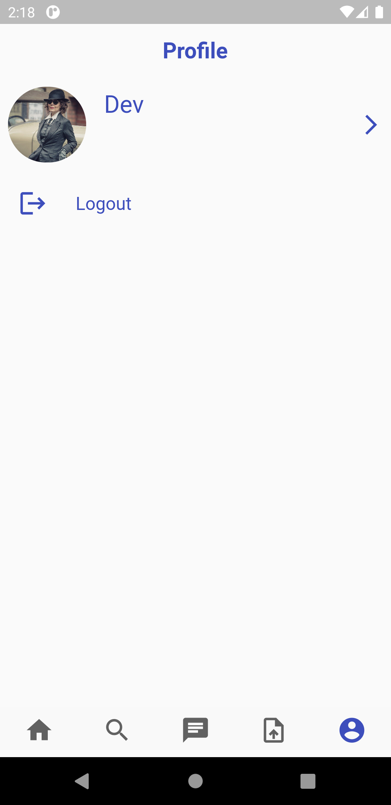

# baadal

A simple Cloud storage app which uses email and password authentication or a google sigin.  
your can upload and download file any type of file with this app.    
It is built using flutter and firebase.

# Apk file

The apk file can found in a folder name apkfolder which is located at the root of the repository.  

 

